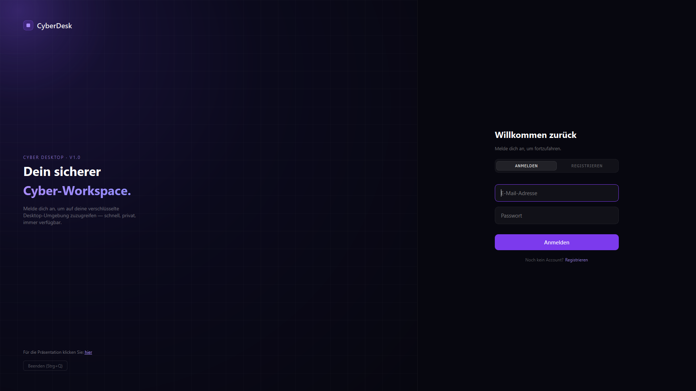
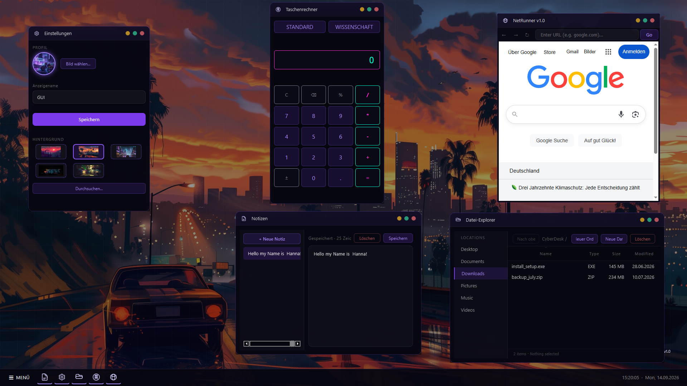

🖥️ CYBERDESK OS — Cyberpunk Desktop Simulation

> 🌱 **Jetzt Open Source (MIT).** Entstanden als Kursprojekt, an der Abgabe
> eingefroren — und offen für alle, die weiterbauen wollen: eigenes Terminal
> nachbauen, VirtualFS erweitern, oder gleich ein ganz eigenes Cyberpunk-Betriebssystem
> draufsetzen. **Einfach Fork erstellen und loslegen!** Details, Lizenz &
> Mitwirkende siehe Abschnitt [🌱 Open Source](#-open-source) ganz unten.

<p align="center">
  
  
</p>

# 📌 Was ist CyberDesk OS?

CyberDesk ist eine Desktop-Simulation im Cyberpunk-Look: Login-Screen, ein Desktop mit
beweglichen Icons und einem echten Fenstersystem, eine Taskbar mit Startmenü, und mehrere
Apps, die jeweils in ihrem eigenen Fenster laufen (öffnen, verschieben, minimieren,
schließen). Kursprojekt im Rahmen der GUI-Weiterbildung, entwickelt gegen das
[`CyberDesk_Projekt-Handbuch.pdf`](CyberDesk_Projekt-Handbuch.pdf) als Vorgabe.

**Der Umfang deckt nicht das komplette Handbuch ab** — dazu hat die Zeit nicht gereicht.
Was real funktioniert, funktioniert aber vollständig (kein Fake-UI ohne Funktion dahinter).
Wo wir vom Handbuch abgewichen sind oder etwas nicht geschafft haben, steht das unten
ehrlich dabei — Abschnitt [„Stand gegenüber dem Handbuch"](#-stand-gegenüber-dem-handbuch).

* **Technologie:** Python 3.11+ / **PySide6** (das Handbuch nennt PyQt6 — funktional
  äquivalentes Qt6-Binding, bewusst getauscht, siehe unten)
* **Architektur:** EventBus (Publish/Subscribe) + WindowManager + AppRegistry
* **Persistenz:** JSON-Dateien unter `data/` (u.a. ein echtes VirtualFileSystem für den
  Datei-Explorer)
* **Tests:** `pytest`, aktuell 13/13 grün · `ruff check` sauber (bis auf 4 bekannte, bewusst
  nicht angefasste Funde in fremdem Code)

---

## 🧠 Architektur — wie das Herzstück funktioniert

Kein Modul kennt ein anderes direkt; alles läuft über einen globalen **EventBus**
(Publish/Subscribe). Ein Klick auf ein Desktop-Icon publiziert z.B. `app.launch` mit der
App-ID — die `AppRegistry` reagiert darauf, egal welche App das ist.

* **`core/event_bus.py`** — der Nachrichtenkanal. `subscribe`/`publish`/`unsubscribe`;
  ein Fehler in einem Handler reißt keine anderen Handler mit.
* **`core/window_manager.py`** — verwaltet jedes offene Fenster (Öffnen, Schließen, Fokus,
  Minimieren/Wiederherstellen, genau eine Instanz pro App).
* **`core/app_registry.py`** — findet jede App automatisch unter
  `apps/<ordner>/<ordner>_app.py` (kein manuelles Registrieren in `main.py` nötig) und
  startet sie auf `app.launch`.
* **`apps/base_app.py`** — Basisklasse für jede App: liefert das komplette
  Fenster-Drumherum (Titelleiste mit App-Icon, Minimieren/Maximieren/Schließen,
  Rand-Resize). Die native Windows-Fensterdekoration wurde bewusst abgeschaltet
  (`Qt.FramelessWindowHint`), weil sie den Cyberpunk-Look nach Figma-Vorlage gesprengt
  hätte — **das komplette Fensterverhalten, das damit sonst verloren geht, ist deshalb
  selbst nachgebaut**: eigene Titelleiste, Verschieben per Drag, Rand-Resize, Minimieren/
  Maximieren/Schließen. Qt liefert davon nichts mehr automatisch, sobald der native
  Rahmen fehlt.
* **`services/virtual_fs.py`** — ein echtes, gemeinsames simuliertes Dateisystem als
  JSON-Baum (`data/filesystem.json`), genau wie im Handbuch beschrieben. Trägt aktuell den
  Datei-Explorer (echte Ordnernavigation).
* **`services/settings.py`** — Profil (Name/Avatar), Desktop-Hintergrund, angeheftete
  Taskbar-Apps.

---

## 🗂️ Apps

| App | Datei | Funktioniert |
|---|---|---|
| **Taschenrechner** | `apps/calculator/` | Standard- + wissenschaftlicher Modus (Trigonometrie, Logarithmen, Potenzen) |
| **NetRunner** | `apps/netrunner/` | Echter eingebetteter Browser (Chromium/`QWebEngineView`) mit Adressleiste — bewusst kein Fake-Lore-Reader, siehe unten |
| **Notizen** | `apps/notes/` | Mehrere Notizen: erstellen, bearbeiten, speichern, löschen, Auto-Save alle 30s |
| **Datei-Explorer** | `apps/file_explorer/` | Echte Ordnernavigation über `services/virtual_fs.py` (Doppelklick öffnet Unterordner), Dateien/Ordner anlegen und löschen, Spalten sortierbar (Name/Typ/Größe/Datum) |
| **Einstellungen** | `apps/settings/` | Profilname + -bild (live im Startmenü, mit Neon-Glow), Desktop-Hintergrund wählen (Presets + eigenes Bild per Dateidialog) |
| **Terminal** | — | ❌ Fehlt komplett — der leere, nicht funktionsfähige Ordner wurde entfernt, um keinen Fehler mehr beim Start zu erzeugen (siehe Stand unten) |

Dazu: Login-/Registrierungs-Screen (Ersatz für den Handbuch-Lockscreen, mit direktem
Link „Für die Präsentation klicken Sie: hier" unten links), Startmenü, Taskbar mit
laufenden Fenstern + Minimieren/Wiederherstellen, Mini-Kalender an der Uhr,
Rechtsklick-Kontextmenü auf dem Desktop (Datei-Explorer, Einstellungen, Hintergrund ändern,
Aktualisieren, Beenden).

---

## 📁 Tatsächliche Ordnerstruktur

```text
CyberDesk OS/
├── main.py                   # Einstiegspunkt – Login-Screen → Desktop
├── README.md
├── requirements.txt           # PySide6, pytest, black, ruff
├── CyberDesk_Projekt-Handbuch.pdf   # Original-Vorgabe des Kurses
├── CyberDesk_Handbuch_v2.pdf         # überarbeitete Fassung, Status pro Kapitel
├── CyberDesk_Praesentation.html      # eigenständige Präsentation, auch vom Login-Screen verlinkt
│
├── core/
│   ├── event_bus.py
│   ├── window_manager.py
│   └── app_registry.py
│
├── ui/
│   ├── desktop.py             # Icons, Wallpaper, Rechtsklick-Kontextmenü
│   ├── taskbar.py             # Taskbar, Startmenü, Mini-Kalender
│   ├── auth_screen.py         # Login/Registrierung (Lockscreen-Ersatz)
│   ├── paint_utils.py         # Gemeinsame QPainter-Helfer (Glow, Grid, Wallpaper)
│   └── widgets/
│       └── app_icon.py        # Desktop-Icon-Widget
│
├── apps/
│   ├── base_app.py            # Basisklasse: Fenster-Chrome, Titelleiste
│   ├── calculator/
│   ├── netrunner/
│   ├── notes/
│   ├── file_explorer/
│   └── settings/
│       # kein terminal/ mehr — leerer, funktionsloser Ordner wurde entfernt
│
├── services/
│   ├── virtual_fs.py           # VirtualFileSystem (JSON-Baum)
│   └── settings.py             # Profil, Wallpaper, angeheftete Apps
│
├── data/                       # zur Laufzeit erzeugt, NICHT versioniert
│   ├── filesystem.json
│   ├── notes.json
│   ├── settings.json
│   ├── avatar/
│   └── wallpapers/              # eigene, per Dateidialog hinzugefügte Hintergründe
│
├── assets/
│   ├── images/                 # Icon-SVGs
│   ├── wallpapers/              # mitgelieferte Hintergrund-Presets
│   └── styles/cyberpunk.qss     # zentrales Stylesheet (violettes Neon-Theme)
│
└── tests/
    ├── test_event_bus.py
    └── test_virtual_fs.py
```

---

## ⚖️ Stand gegenüber dem Handbuch

Ausführlicher Kapitel-für-Kapitel-Abgleich in der Präsentation — hier die Kurzfassung.

### Bewusste Abweichungen (nicht "vergessen", sondern entschieden)
* **PySide6 statt PyQt6** — funktional äquivalentes Qt6-Binding, unproblematischere Lizenz.
* **Violettes Neon-Theme statt Cyan/Magenta** — eigene Figma-Vorlage, dafür konsequent
  überall umgesetzt (keine grauen Standard-Buttons).
* **NetRunner als echter Browser** statt eines fiktiven Lore-Readers — funktional stärker,
  konzeptionell bewusst anders.
* **Notizen ohne VirtualFS** — eigenes Schema für mehrere benannte Notizen statt einer
  einzelnen `notes.txt`-Datei; der Datei-Explorer nutzt das VirtualFS, Notizen bewusst nicht.
* **Native Fensterdekoration abgeschaltet, Fensterverhalten selbst nachgebaut** (kein
  natives Windows-Fenster) für den durchgängigen Cyberpunk-Look nach Figma-Vorlage —
  siehe Architektur-Abschnitt oben.

### Fertig & funktionsfähig
Kernsystem (EventBus/WindowManager/AppRegistry/BaseApp), Login-Screen, Desktop mit
Icon-Grid + Wallpaper-Wechsel + Rechtsklick-Menü, Taskbar mit Minimieren/Wiederherstellen,
Startmenü, Mini-Kalender, sowie 5 laufende Apps (Taschenrechner, NetRunner, Notizen,
Datei-Explorer, Einstellungen).

### Teilweise umgesetzt
* **Datei-Explorer:** echte Ordnernavigation, aber kein Doppelklick-Öffnen einer Datei in
  einer passenden App, kein Rechtsklick-Kontextmenü auf Einträgen, kein `.secret/`-Ordner.
* **Cyberpunk Look & Feel:** Farben/Glow/Buttons konsequent umgesetzt, aber keine
  Scanlines, kein Boot-Glitch, keine Sounds.
* **README/Doku:** dieses Dokument — vorher eine unveränderte Kopie des Handbuch-Plans.

### Nicht geschafft (Zeit hat nicht gereicht)
* **Terminal** — gab es früher im Projekt (siehe Git-Historie), ist seither verlorengegangen
  und wurde nicht neu gebaut. Der leere, funktionslose `apps/terminal/`-Ordner wurde
  entfernt, damit die App beim Start keinen Fehler mehr dazu meldet.
* **SysMon** — nicht gebaut (im Funktionsumfang teilweise durch Taschenrechner/Einstellungen
  ersetzt, die im Handbuch nicht vorgesehen waren).
* **Easter Eggs** (Handbuch Kapitel 13) — keines umgesetzt.
* **Drag & Drop** zwischen Datei-Explorer und anderen Apps — nicht umgesetzt.
* **Fensterpositionen** werden nicht über einen Neustart hinweg gespeichert (Notizen,
  Profil und Wallpaper schon).

---

## 🚦 Coding Rules & Richtlinien

* **Commit-Nachrichten:** *Conventional Commits* (z.B. `feat(taskbar): …`,
  `fix(window_manager): …`).
* **Code-Stil (PEP8):** 4 Spaces Einrückung, Type Hints und Docstrings für öffentliche
  Klassen/Funktionen.
* **Kein Vibe Coding:** Wer Code committet, muss ihn erklären können.
* **Vor jedem Push:** `black .` und `ruff check .`

---

## 🚀 Setup & Start

* **Repository klonen:** `git clone <repository-url>`
* **In den Projektordner wechseln:** `cd os-cyberdesktop`
* **Virtuelle Umgebung erstellen:** `python -m venv venv`
* **VENV aktivieren (Windows/PowerShell):** `.\venv\Scripts\Activate.ps1`
* **VENV aktivieren (Linux/macOS):** `source venv/bin/activate`
* **Abhängigkeiten installieren:** `pip install -r requirements.txt`

### Anwendung ausführen
* **Simulation starten:** `python main.py`
* **Tests ausführen:** `pytest`
* **Linter ausführen:** `ruff check .`

---

## 🌱 Open Source

Der Kurs, für den dieses Projekt entstanden ist, endete mit der Abgabe — an
genau diesem Stand wurde die Entwicklung eingefroren (siehe oben, [„Stand
gegenüber dem Handbuch"](#-stand-gegenüber-dem-handbuch)). Danach wurde das
Projekt unter MIT-Lizenz als Open Source veröffentlicht: Wer Lust hat —
Terminal nachbauen, VirtualFS erweitern, eigene Apps beisteuern oder sonst
etwas Eigenes ausprobieren — kann einfach forken und loslegen.

Mitwirkende siehe [CONTRIBUTORS.md](CONTRIBUTORS.md) · Lizenz siehe
[LICENSE](LICENSE).
